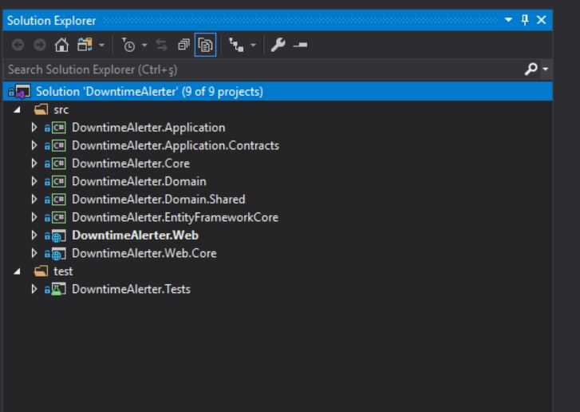
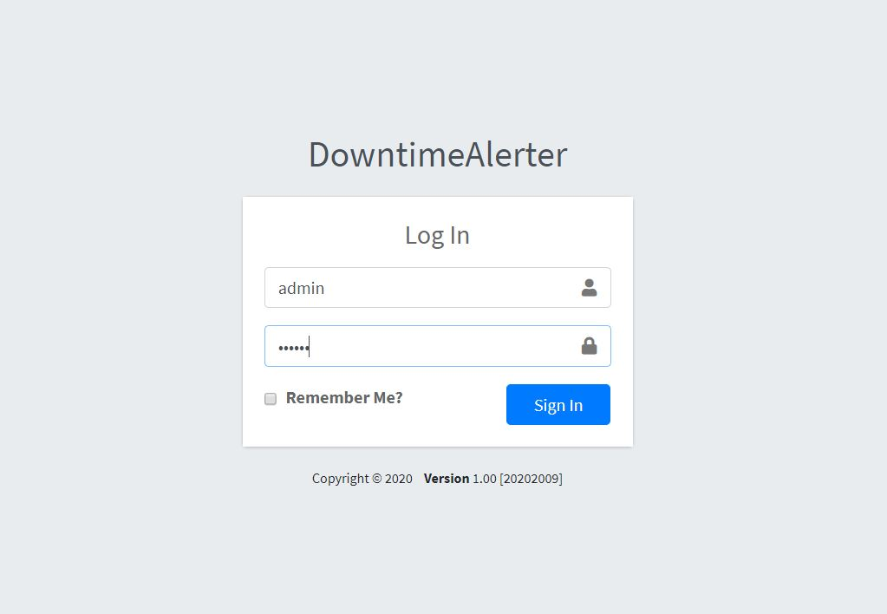
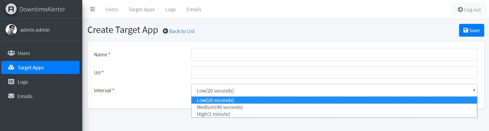
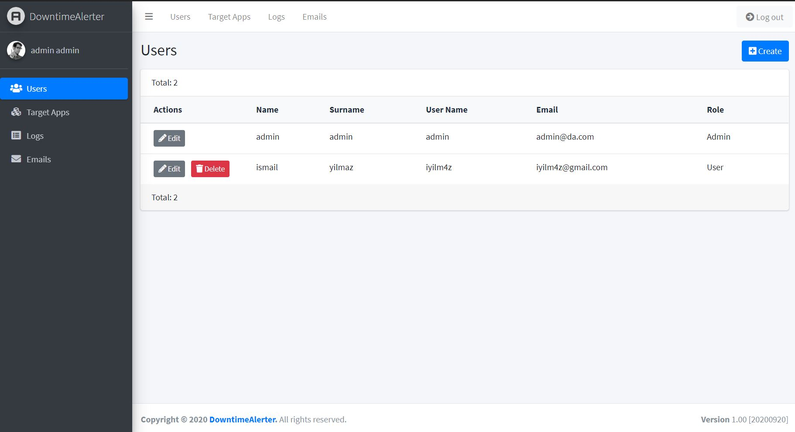
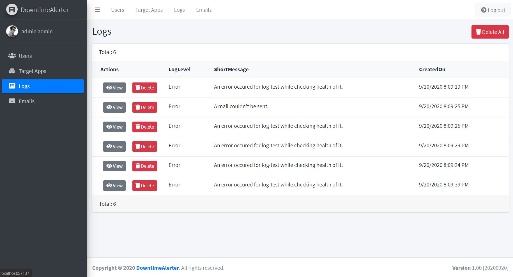

# downtime-alerter
A web application to monitor health checks of any targeted website by url.

## Screenshots

| Structure | Login |
| :--- | :--- |
|  |  |

| Target Apps | Target App Create |
| :--- | :--- |
|  |  |

| User List | Logs List |
| :--- | :--- |
|  |  |

| Email Nofications in Gmail | Sent Email List |
| :--- | :--- |
|  |  |